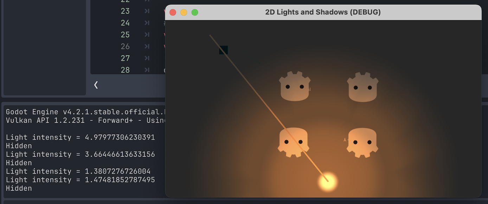

# 2D Lights and Shadows

Fork of Godot's demo of 2D lights and shadows
Original demo on the asset library: https://godotengine.org/asset-library/asset/116

This just calculates the light intensity hitting a 2D position. Did the same mechanism for a 3D stealth game in Unreal Engine nearly a decade ago now 👴 

Have an idea to create a small 2D stealth game for a game jam, but needed to PoC

## Screenshots

